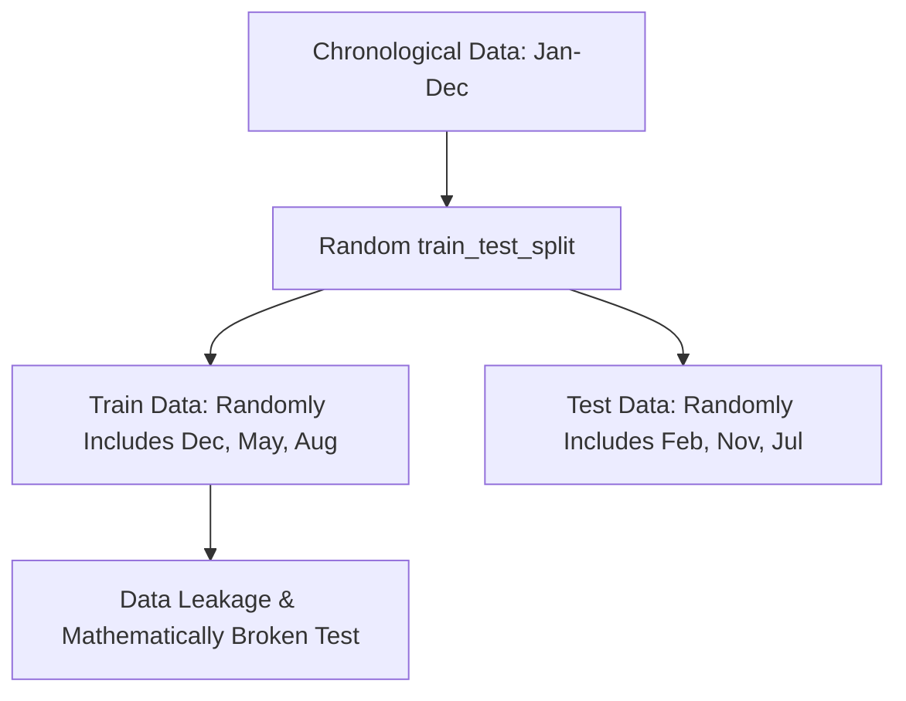
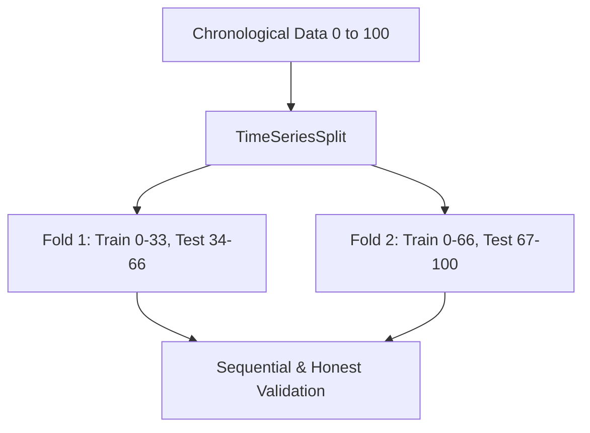

# Time-Series Machine Learning Workflow

## What This Is

Time-series data is a sequence of data points indexed in chronological time order (e.g., daily stock prices, hourly weather metrics).

Standard machine learning approaches fail on time-series data because they assume all data points are independent and randomly distributed. Time-series data violates this rule: what happens tomorrow relies heavily on what happened today. Time-series ML involves structuring historical data correctly so models can recognize past patterns to predict unknown future values cleanly, without accidentally looking into the "future" during training.

## When to Use

- **Forecasting:** Predicting future sales, demand, or resource utilization.
- **Trend prediction:** Identifying long-term upward or downward movements in datasets.
- **Sequential data problems:** Any dataset where the order of operations strictly dictates the outcome.

## Installation

```bash
pip install pandas scikit-learn numpy
```

## WRONG vs CORRECT Approach (IMPORTANT)

### ❌ WRONG: Random `train_test_split`

Using standard random splitting jumbles the dates. Your model might be given data from December to train on, and then tested on data from October. This creates massive data leakage, as the model has essentially learned from future events.

### ✅ CORRECT: `TimeSeriesSplit`

This splits the data sequentially. It trains on a block of historical data and tests ONLY on data occurring chronologically *after* that block.

## Core Concepts

### Time Order Dependency

The fundamental property that newer data is statistically related to older data. Order cannot be ignored.

### Lag Features

Metrics from previous time steps added as new predictor columns. Example: "Yesterday's sales" used as a predictor for "Today's sales."

### Rolling Features

Statistical calculations created over a time window. Example: "7-day moving average" provides models with a localized trend.

### Time-based splitting

Always testing the model on the chronological future relative to the training set.

## Visual Representation (IMPORTANT)

### Wrong Pipeline (Random Split)



### Correct Pipeline (Time-Aware Split)



## Step-by-Step Implementation

To correctly feed standard deterministic machine learning models (like Random Forests or Gradient Boosted Trees) with sequential data, implement this structured approach:

### Step 1: Ensure Strict Chronological Order

Time-series algorithms require data to be explicitly sorted along the timeline dimension. Shuffled indexes will destroy feature engineering completely.

```python
import pandas as pd
import numpy as np

# Simulate daily sequential data
dates = pd.date_range('2023-01-01', periods=100)
targets = np.linspace(1, 100, 100) + np.random.normal(0, 5, 100)

data = pd.DataFrame({'date': dates, 'target': targets})

# CRITICAL: Always ensure time logic is absolute and sorted
data = data.sort_values(by='date').reset_index(drop=True)
data.set_index('date', inplace=True)
```

### Step 2: Create Lag & Rolling Features

Because standard ML models process rows individually, they have natively zero context of prior records. You must manually package the "past" into the current row horizontally using `shift()`.

```python
# Create Lag Features (Looking directly backwards)
data['lag_1'] = data['target'].shift(1) # Value 1 day ago
data['lag_3'] = data['target'].shift(3) # Value 3 days ago
data['lag_7'] = data['target'].shift(7) # Value 7 days ago

# Create Rolling Features (Looking at windows safely)
# Using 'closed=left' ensures today's target doesn't leak into the rolling average
data['rolling_3_mean'] = data['target'].rolling(window=3, closed='left').mean()
```

### Step 3: Handle Induced Missing Values

Shifting data inherently creates `NaN` values at the very beginning of the series (because there is no data prior to day 1 to pull from). You must carefully drop or impute them securely without corrupting order.

```python
# Drop rows that contain NaN due to shifting
cleaned_data = data.dropna().reset_index(drop=True)

print(f"Original shape: {data.shape}")
print(f"Cleaned shape: {cleaned_data.shape}")
```

### Step 4: Define Features and Target

Separate the newly horizontal historical features from the target value waiting to be predicted.

```python
# The standard y target to predict
y = cleaned_data['target']

# The X variable only contains strict historical context parameters
X = cleaned_data.drop(columns=['target'])
```

### Step 5: Implement Time-Aware Cross Validation

You cannot use standard `cross_val_score` or `train_test_split`. Instead, leverage `TimeSeriesSplit` to slice the data sequentially, keeping structural integrity intact.

```python
from sklearn.model_selection import TimeSeriesSplit
from sklearn.ensemble import RandomForestRegressor

# Define 5 sequential splits
# Expanding Window format mathematically guarantees test sets are strictly after train sets.
tscv = TimeSeriesSplit(n_splits=5)

model = RandomForestRegressor(random_state=42)
```

### Step 6: Execute the Evaluation Workflow

Iterate manually through the constructed sequentially split indices to ensure model learning is uncorrupted.

```python
from sklearn.metrics import mean_squared_error

fold_errors = []

# tscv.split provides the exact numerical indices for safe splits
for fold_num, (train_index, test_index) in enumerate(tscv.split(X)):
  
    # Isolate splits using the absolute chronological position
    X_train, X_test = X.iloc[train_index], X.iloc[test_index]
    y_train, y_test = y.iloc[train_index], y.iloc[test_index]
  
    # Note: Model is wiped and refit fresh inside each loop physically
    model.fit(X_train, y_train)
  
    # Predict the unseen, strictly future test fold
    predictions = model.predict(X_test)
  
    # Record and summarize performance
    mse = mean_squared_error(y_test, predictions)
    fold_errors.append(mse)
    print(f"Fold {fold_num+1} | Train Size={len(X_train)} Test Size={len(X_test)} | MSE={mse:.2f}")

print(f"\nAverage System Cross-Validation MSE: {np.mean(fold_errors):.2f}")
```

## Practical Notes

- Never shuffle time-series data. Setting `shuffle=True` in standard scikit-learn cross-validation destroys the temporal logic and leads to data leakage.
- Handle missing values after shifting your data. Lags inherently create nulls in the first `N` rows which usually need to be explicitly dropped.
- Use multiple lags to capture complex seasonality (e.g., lag 1, lag 7, lag 30).

## References (IMPORTANT)

- [Scikit-learn Documentation: TimeSeriesSplit](https://scikit-learn.org/stable/modules/generated/sklearn.model_selection.TimeSeriesSplit.html)
- [Machine Learning Mastery: Machine Learning for Time Series Forecasting](https://machinelearningmastery.com/machine-learning-for-time-series-forecasting/)
- [Towards Data Science: Time Series cross-validation](https://towardsdatascience.com/time-series-machine-learning-regression-framework-9ea33929009a)
- [Scikit-learn Documentation: Cross-validation focusing on independent data](https://scikit-learn.org/stable/modules/cross_validation.html#cross-validation-of-time-series-data)
