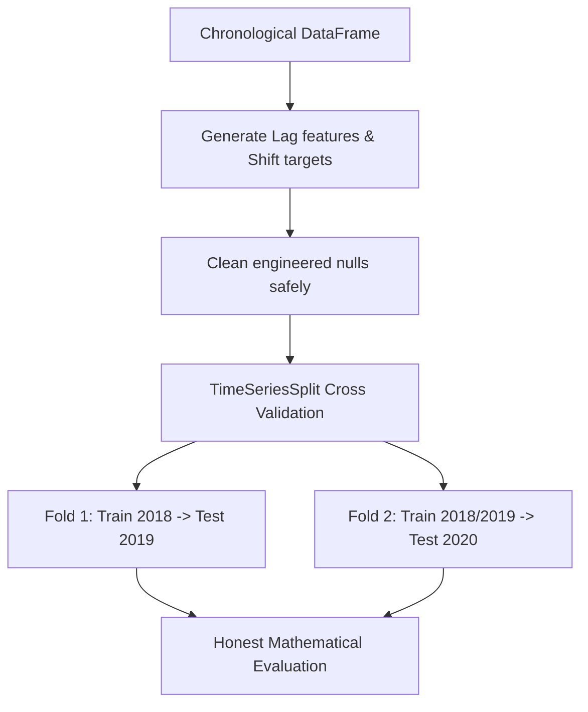

# Time-Series Machine Learning Workflow

Welcome to the **Time-Series Machine Learning Workflow** educational module!

This open-source learning resource is designed to teach you how to appropriately structure machine learning pipelines and models specifically for times-series and sequential data. Standard machine learning algorithms assume independent data points, but time-series analysis requires a fundamental shift in how we handle, engineer, and validate our datasets to ensure mathematical integrity and high performance.

## What You’ll Learn

- **Fundamental Theory**: The core concepts underlying time-aware ML versus independent randomized ML.
- **Feature Engineering**: Safely generating historic predictive windows through **Lag features** and **Rolling averages**.
- **Data Integrity**: How to combat internal null values introduced by chronological shifting.
- **Validation Strictness**: Enforcing proper, leak-free validation logic using scikit-learn's `TimeSeriesSplit`.
- **Complete Workflow Execution**: Building a continuous, end-to-end pipeline that trains responsibly on historical data to predict the strictly unseen future.

## Prerequisites

To get the most out of this skill, ensure you have:

- Basic familiarity with Python data manipulation using `pandas`.
- A foundational understanding of standard ML validation concepts (e.g., standard train/test subsets).
- General experience utilizing `scikit-learn` algorithms.

## Structure

The educational materials are contained in this directory:

```text
time-series-ml-workflow/
├── SKILL.md    # The core, step-by-step technical implementation guide
└── resources/
    └── README.md   # This overview and map
```

## How to Use This Skill

Start by opening the `SKILL.md` document. Read through the conceptual differences between random splitting and sequential splitting. After absorbing the theory, follow the **Step-by-Step Implementation** guide. You can copy the rich, heavily annotated Python snippets directly into a local Python environment or Jupyter Notebook to safely execute the time-aware workflow.

## Why This Matters

Treating time-series data like normal tabular datasets and using standard randomized splits (like `train_test_split`) causes catastrophic **data leakage**. When randomly split, the model accidentally "peaks" at future events during its training phase, yielding miraculously high accuracy during validation, but failing instantly upon real-world deployment.

Understanding strict, time-aware cross-validation structures entirely prevents this mathematical leakage, enforces forecasting honesty, and vastly improves practical prediction accuracy in production business environments.

## Visual Overview

The diagram below maps the exact execution flow required to process chronological data safely:


