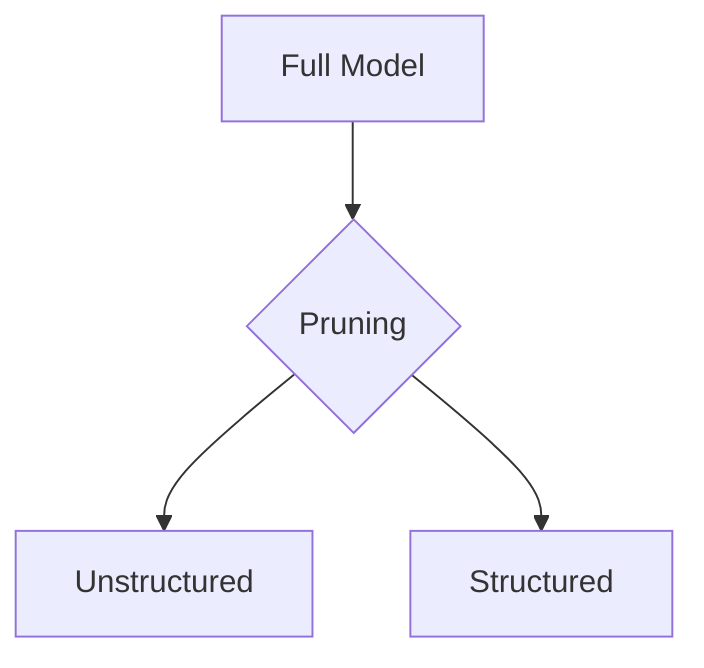
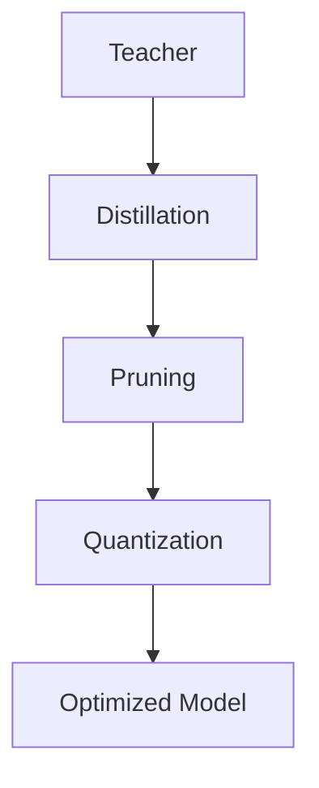

# ⚡ Compressing Intelligence: Model Optimization for Real Systems


Welcome! In this skill, you’ll learn how modern AI systems transform large models into efficient, deployable systems used in real-world applications.

---

## 🎯 What you'll learn

* Why large models are inefficient
* How to compress models using:

  * Distillation
  * Pruning
  * Quantization
* How to design real-world optimization pipelines

---

# 🪜 Step-by-step learning journey

---

## 🧠 Step 1: Understand the problem

### 🎯 Goal

Recognize why large models fail in real-world deployment.

### Key Issues

* High memory usage
* Slow inference
* High energy consumption

💡 Insight
A model that is 99% accurate but too slow is unusable in production.

👉 **Task**

* Identify 2 scenarios where latency is critical
* Explain how large models would fail there

---

# 🔥 Step 2: Knowledge Distillation

---

## 2.1 Concept

### 🎯 Goal

Understand how knowledge is transferred from large to small models.

Distillation trains a **student model** to mimic a **teacher model**.


💡 Insight
Distillation preserves knowledge, not just predictions.

👉 Task
Why is learning probabilities better than learning labels?

---

## 2.2 How it works

### 🎯 Goal

Understand the training mechanism behind distillation.

* Teacher outputs soft probabilities
* Student learns using temperature scaling
* Loss combines:

  * KL divergence
  * Cross entropy

💡 Insight
Higher temperature smooths probability distribution → richer learning.

👉 Task
What happens if temperature is too low?

---

## 2.3 Implementation

### 🎯 Goal

Apply distillation in a real ML workflow.

```python id="distill_code"
import torch.nn.functional as F

def distillation_loss(student_logits, teacher_logits, labels, T=4, alpha=0.7):
    soft_loss = F.kl_div(
        F.log_softmax(student_logits/T, dim=1),
        F.softmax(teacher_logits/T, dim=1),
        reduction='batchmean'
    ) * (T*T)

    hard_loss = F.cross_entropy(student_logits, labels)
    return alpha * soft_loss + (1 - alpha) * hard_loss
```

💡 Insight
Distillation often improves generalization due to regularization.

👉 Task
Why can a student outperform a teacher model?

---

# ✂️ Step 3: Pruning

---

## 3.1 Concept

### 🎯 Goal

Understand how models remove redundancy.

Pruning removes weights with minimal contribution.

💡 Insight
Neural networks are often over-parameterized.

👉 Task
Why can large portions of a network be removed without major accuracy loss?

---

## 3.2 Types

### 🎯 Goal

Differentiate pruning strategies.



* Unstructured → removes individual weights
* Structured → removes channels

💡 Insight
Hardware prefers structured sparsity.

👉 Task
Which pruning type is better for GPUs and why?

---

## 3.3 Implementation

### 🎯 Goal

Apply pruning using real frameworks.

```python id="prune_code"
import torch.nn.utils.prune as prune

prune.ln_structured(model.conv1, name="weight", amount=0.4, dim=0)
```

💡 Insight
Pruning must be followed by fine-tuning.

👉 Task
What happens if you prune without retraining?

---

# ⚡ Step 4: Quantization

---

## 4.1 Concept

### 🎯 Goal

Understand precision reduction.


💡 Insight
Lower precision reduces memory and compute cost.

👉 Task
Why does reducing precision improve speed?

---

## 4.2 Workflow

### 🎯 Goal

Apply quantization in practice.

```python id="quant_code"
import torch.quantization as quant

model.qconfig = quant.get_default_qconfig('fbgemm')
quant.prepare(model, inplace=True)
quant.convert(model, inplace=True)
```

💡 Insight
Quantization introduces noise—training must adapt.

👉 Task
What errors can quantization introduce?

---

## 4.3 PTQ vs QAT

### 🎯 Goal

Understand trade-offs.

| Method | Speed  | Accuracy |
| ------ | ------ | -------- |
| PTQ    | Fast   | Lower    |
| QAT    | Slower | High     |

💡 Insight
QAT simulates quantization during training.

👉 Task
When would you choose PTQ over QAT?

---

# 🔗 Step 5: Build the pipeline

### 🎯 Goal

Combine all optimization techniques.



💡 Insight
Order determines final performance.

👉 Task
Why should pruning come before quantization?

---

# 📊 Step 6: Evaluate improvements

### 🎯 Goal

Measure optimization impact.

| Metric  | Original | Optimized |
| ------- | -------- | --------- |
| Size    | 31 MB    | 3 MB      |
| Latency | 42 ms    | 11 ms     |
| Memory  | 122 MB   | 28 MB     |

💡 Insight
Optimization is about trade-offs, not perfection.

👉 Task
Which metric matters most for:

* battery
* speed

---

# 🚀 Step 7: Real-world systems

### 🎯 Goal

Apply concepts in production.

* Mobile → small models
* LLMs → memory optimization
* Edge → power efficiency

💡 Insight
Modern AI systems are memory-bound.

👉 Task
Why is memory bandwidth more critical than compute?

---

# 🎨 Final Challenge

### 🎯 Goal

Design a complete optimized ML system.

Requirements:

* Use all three techniques
* Target mobile deployment
* Balance speed vs accuracy

---

# 🏁 Summary

You learned:

* Distillation → knowledge transfer
* Pruning → remove redundancy
* Quantization → efficiency

👉 These together enable scalable AI systems.

---

**You’re now thinking like an ML systems engineer—go build efficient intelligence.**
